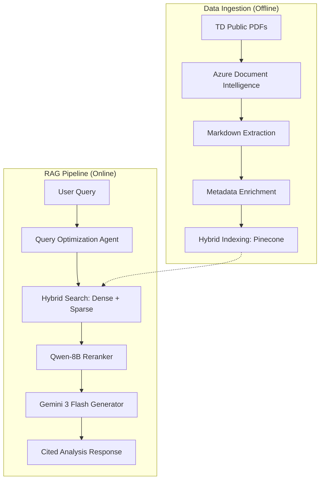

# 🏦 TD Bank Equity Research Analyst AI

A production-grade Retrieval-Augmented Generation (RAG) system designed to analyze TD Bank Group's financial reports with high precision, hybrid search, and senior analyst-level reasoning.

## 🏗️ System Architecture



## 📂 Project Structure (ML Production Layout)

```text
FinanceAgent/
├── data/                  # Data Lake
│   ├── raw/               # Original PDF reports
│   ├── processed/         # Azure Document Intelligence MD output
│   ├── intermediate/      # Raw JSON document structure
│   └── final/             # Cleaned, chunked, and enriched JSON (RAG-ready)
├── src/                   # Source Code
│   ├── common/            # Shared configuration and lazy-loading utilities
│   ├── ingestion/         # Data processing and indexing pipeline
│   └── inference/         # RAG chain, retrieval, and generation logic
├── models/                # Local model artifacts (e.g., BM25 models)
├── .streamlit/            # Streamlit-specific configuration
├── app.py                 # Main Streamlit Dashboard
└── README.md              # Project documentation
```

## 🚀 Key Features

- **Hybrid Retrieval**: Combines semantic understanding (**Voyage Finance-2**) with keyword precision (**BM25**).
- **Reranking Step**: Uses **Qwen3-Reranker-8B** to ensure the most relevant financial context is prioritized.
- **Lazy Loading**: Optimized startup performance using deferred imports and client initializations.
- **Metadata-Driven Grounding**: Filters search by Year, Quarter, and Document Type (10-K/10-Q) automatically.
- **Strict Analyst Persona**: Ensures all responses are grounded in provided reports with mandatory citations and math verification.

## 🛠️ Setup & Usage

### 1. Environment Configuration
Create a `.env` file in the root directory with the following keys:
```env
PINECONE_API_KEY=...
VOYAGE_API_KEY=...
GROQ_API_KEY=...
DEEPINFRA_TOKEN=...
DOCUMENTINTELLIGENCE_ENDPOINT=...
DOCUMENTINTELLIGENCE_API_KEY=...
GOOGLE_API_KEY=...
```

### 2. Installation
```bash
pip install -r requirements.txt
```

### 3. Running the Dashboard
```bash
streamlit run app.py
```

## 📊 Pipeline Modules

- **Ingestion**: Handles PDF discovery, Azure transformation, and metadata enrichment via Llama 3.
- **Retriever**: Translates natural language into Pinecone filters and hybrid search weights.
- **Generator**: Formats context and orchestrates the final Gemini response.

## 🗺️ Future Roadmap

- [ ] **Earnings Transcripts Ingestion**: Expand the pipeline to ingest and parse quarterly earnings call transcripts for qualitative sentiment analysis.
- [ ] **Advanced Evaluation**:
    - Integrate **Ragas** (Retrieval-Augmented Generation Assessment) for automated component-level metrics.
    - Implement **Conformal RAG** to provide statistical guarantees on model responses.
- [ ] **DevOps & Scaling**:
    - Automate builds with **GitHub Actions**.
    - Orchestrate container deployment using **Kubernetes (K8s)**.
- [ ] **UI/UX Enhancements**:
    - **Reranking Transparency**: Display the relevance scores from the Qwen-8B reranker in the UI to build user trust.
    - **Real-time Discovery**: Add a frontend trigger to initiate the ingestion of the latest available reports without restarting the app.
- [ ] **Additional Agent Toolset**:
    - Add built-in calculator for ratio analysis, valuation metrics, and scenario modeling.
    - Integrate real-time stock price retrieval via APIs (e.g., Yahoo Finance, Alpha Vantage).
    - Support additional agent actions like financial statement fetching, dividend history, and market comparison.

---
*Developed for high-fidelity financial analysis of TD Bank Group.*
